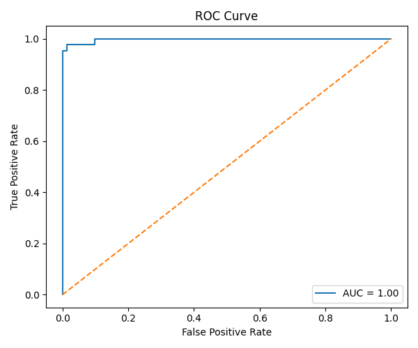
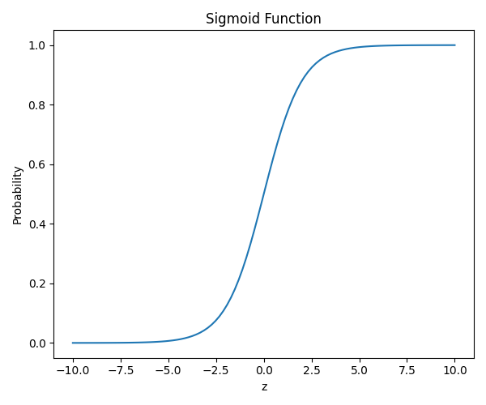

# 🧠 Breast Cancer Classification – Logistic Regression

## 📌 Objective

Build a binary classification model using Logistic Regression to predict whether a tumor is:

* M (Malignant)

* B (Benign)

## 🛠 Tools Used

* Python

* Pandas

* Scikit-learn

* Matplotlib

* Seaborn

## 📂 Dataset

Breast Cancer Wisconsin Dataset

Target Variable: diagnosis

## ⚙️ Steps Performed

1. Loaded dataset

2. Converted categorical labels to binary (M=1, B=0)

3. Train-test split (80/20)

4. Standardized features

5. Trained Logistic Regression model

6. Evaluated using:

* Confusion Matrix

* Precision & Recall

* ROC Curve

* ROC-AUC Score

## 📊 Evaluation Metrics
### Confusion Matrix

Shows:

* True Positives

* False Positives

* True Negatives

* False Negatives

### Precision

Out of predicted positives, how many were correct?

### Recall

Out of actual positives, how many were correctly identified?

### ROC-AUC

Measures model’s ability to distinguish classes.
Higher AUC → Better performance.

## 📈 Generated Graphs

### 1. Confusion Matrix

### 2. ROC Curve

### 3. Sigmoid Function Curve

## 🔍 Key Learnings

* Logistic Regression is used for classification.

* It uses the Sigmoid Function to convert linear output into probability.

* Threshold (default 0.5) determines class prediction.

## 🎯 Conclusion

The model successfully classified breast cancer tumors with strong performance using Logistic Regression and standard evaluation metrics.
